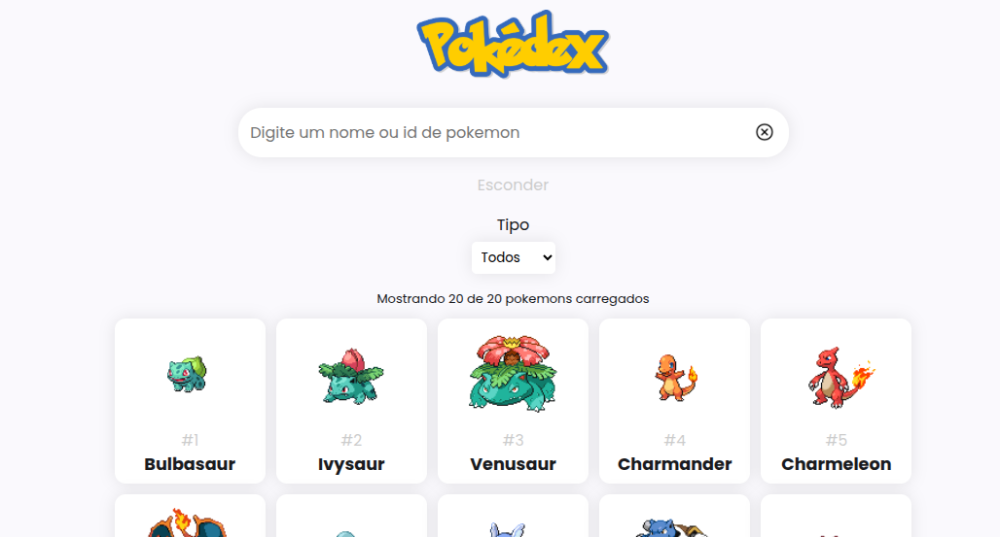
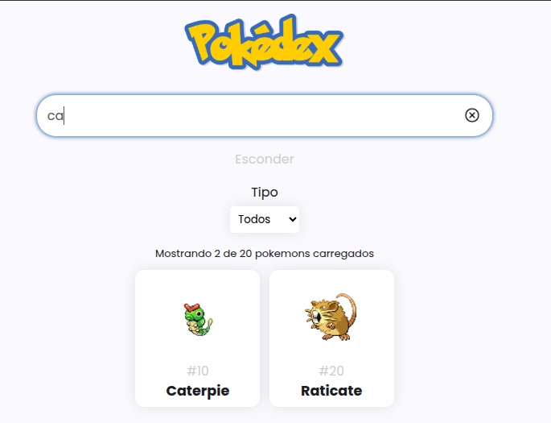
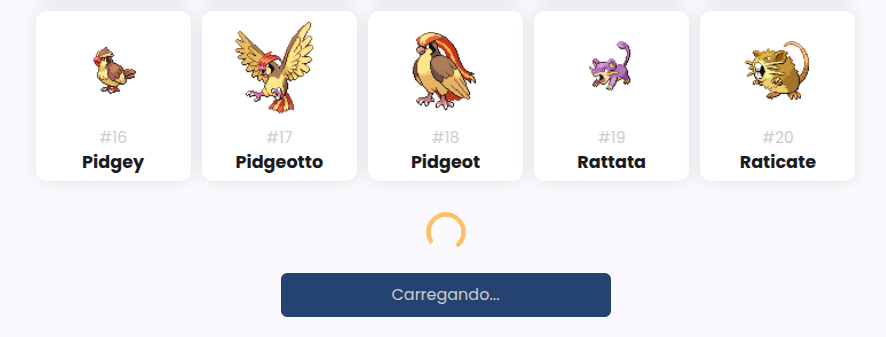
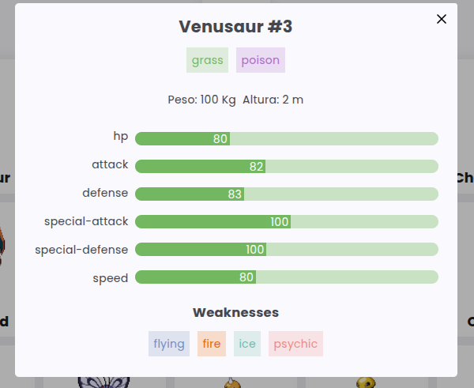

# Pokédex

Projeto desenvolvido para maior imersão no mundo dos observables e API requests no Angular

## Veja o site

Clique [nesse link](https://ramon-erik.github.io/personal-pokedex/) para acessar o site da Pokédex

## Como funciona

O site incia com o request dos primeiros vinte pokemons, mostrando imagem, nome e id e com o botão de carregar mais pokemons. É possível mostrar as estastiticas do pokemon clicando na sua foto, por meio de um modal que é disparado. Além disso é possível filtrar os pokemons já pesquisados por nome (nome parecido) e id (extritamente igual).

## Fotos do projeto

### Tela inicial

### Filtrando pokemons por nome

### Carregar mais pokemons

### Informações do pokemon

## Próximos passos:

- Pesquisa de um pokemon por nome na API;
- Carregar pokemons pelo filtro acionado;
- Carregar os tipos de pokemon para calcular as fraquezas sem  necessidade de novas requisições;
- Adicionar as fraquezas nos pokemons;
- Filtrar pokemons por fraqueza;